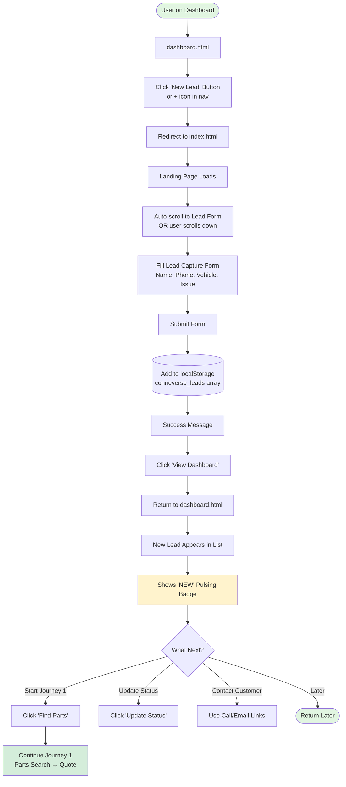

```mermaid
flowchart TD
    Start([User Lands on index.html]) --> LandingPage[Landing Page]
    LandingPage --> FillForm[Fill Lead Capture Form<br/>Name, Phone, Vehicle, Issue]
    FillForm --> Submit[Submit Form]
    Submit --> LocalStorage[(Store in localStorage)]
    LocalStorage --> Success[Success Message Displayed]
    Success --> ClickDashboard[Click 'View Dashboard' Link]
    ClickDashboard --> Dashboard[dashboard.html Loads]
    Dashboard --> LeadsList[View Leads List<br/>Sorted by newest first]
    LeadsList --> SelectLead[Click Lead Card]
    SelectLead --> LeadDetails[Lead Details Displayed]
    LeadDetails --> FindParts[Click 'Find Parts & Create Quote']
    FindParts --> PartsModal[Parts Modal Opens]
    PartsModal --> SearchAI[Click 'Search for Parts with AI']
    SearchAI --> Loading[Loading Animation<br/>2 second delay]
    Loading --> AIResults[AI Analyzes Issue<br/>Shows 4 Part Options]
    AIResults --> CompareParts{Review Parts<br/>Price, Delivery, Rating}
    CompareParts --> SelectPart[Click 'Select' on Best Part]
    SelectPart --> GenerateQuote[Auto-generate Professional Quote<br/>Parts + Labor + Tax]
    GenerateQuote --> QuoteModal[Quote Modal Opens]
    QuoteModal --> ReviewQuote[Review Quote Details]
    ReviewQuote --> SendQuote[Click 'Send Quote']
    SendQuote --> UpdateStatus[Update Lead Status to 'Quote Sent']
    UpdateStatus --> SaveQuote[(Save Quote Amount to Lead)]
    SaveQuote --> Toast[Success Toast Notification]
    Toast --> CloseModal[Modal Closes]
    CloseModal --> UpdatedDashboard[Dashboard Refreshes<br/>Lead shows Quote Sent badge]
    UpdatedDashboard --> End([Complete])

    style Start fill:#e1f5e1
    style End fill:#e1f5e1
    style AIResults fill:#fff3cd
    style GenerateQuote fill:#fff3cd
    style SendQuote fill:#d4edda
```

# User Flow Documentation - Repair Shop AI MVP

## Overview
This document outlines the two primary user journeys in the Repair Shop AI application, along with identified pain points and recommended improvements.

---

## Journey 1: New Lead to Quote

### Mermaid Flowchart



### Step-by-Step Guide

#### Phase 1: Lead Capture (Landing Page)
**File: `index.html`**

1. **User arrives at landing page**
   - Sees hero section with value proposition
   - Views feature benefits (AI-powered search, multi-supplier comparison, instant quotes)

2. **User fills out demo lead form**
   - **Required fields:**
     - Customer Name (text input)
     - Phone Number (tel input)
     - Vehicle Make (text input)
     - Vehicle Model (text input)
     - Vehicle Year (number input)
     - Issue Description (textarea)
   - **Optional field:**
     - Email Address

3. **User submits form**
   - Form validates required fields (HTML5 validation)
   - JavaScript captures form data
   - Creates lead object with:
     - Timestamp
     - Status: "New"
     - All form data
   - Saves to `localStorage` under key `conneverse_leads`

4. **Success confirmation**
   - Form disappears
   - Success message displays
   - Link to dashboard appears
   - User clicks "View Dashboard"

#### Phase 2: Dashboard & Lead Selection
**File: `dashboard.html`**

5. **Dashboard loads**
   - Reads all leads from `localStorage`
   - Displays leads in grid/list view
   - Sorts by timestamp (newest first)
   - Shows status badges (color-coded)

6. **User browses leads**
   - Each lead card shows:
     - Customer name and contact info
     - Vehicle details (in blue info box)
     - Issue description
     - Status badge
     - Quote amount (if exists)
     - **"NEW"** pulsing badge (if < 24 hours old)

7. **User selects a lead**
   - Clicks on lead card or "Find Parts & Create Quote" button
   - Lead ID stored in `currentLead` variable

#### Phase 3: AI Parts Search
**File: `app.js` (lines 571-709)**

8. **Parts modal opens**
   - Displays lead summary (customer, vehicle, issue)
   - Shows "Search for Parts with AI" button

9. **User initiates AI search**
   - Clicks search button
   - Button disappears
   - Loading animation appears with message:
     - "Searching multiple suppliers..."
     - "Comparing prices and availability..."
     - "Finding the best deals..."

10. **AI analysis (2-second delay)**
    - System analyzes issue description keywords
    - Detects part type:
      - "brake" → Brake components
      - "oil" → Oil & filter
      - "alternator" / "battery" → Alternator
      - "air" / "a/c" → AC compressor
      - Default → Generic parts
    - Retrieves 4 matching parts from database

11. **Parts results display**
    - Shows 4 parts in grid layout
    - Each part shows:
      - **"BEST VALUE"** badge (on top-rated option)
      - Part name and brand
      - Supplier name
      - Price
      - Delivery estimate
      - Rating (stars)
      - Stock status
      - **"Select"** button
    - Plus labor cost display

#### Phase 4: Quote Generation & Sending
**File: `app.js` (lines 711-882)**

12. **User selects a part**
    - Clicks "Select" button on preferred option
    - Part stored in `currentPart` variable

13. **Auto-generate quote**
    - System calculates:
      - Part cost
      - Labor cost (predefined for part type)
      - Subtotal
      - Tax (8%)
      - Total
    - Creates professional quote HTML with:
      - Your company branding
      - Customer information
      - Vehicle details
      - Itemized breakdown
      - Valid for 7 days notice
      - Terms & conditions

14. **Quote modal opens**
    - User reviews complete quote
    - Print option available
    - Can close or send

15. **User sends quote**
    - Clicks "Send Quote to Customer" button
    - System updates:
      - Lead status → "Quote Sent"
      - Stores quote amount
      - Saves timestamp
    - Success toast notification appears
    - Modal closes automatically

16. **Dashboard updates**
    - Lead card refreshes
    - Shows "Quote Sent" status badge
    - Displays quote amount
    - Lead moves in sorted order if applicable

---

## Journey 2: Creating New Lead from Dashboard

### Mermaid Flowchart



### Step-by-Step Guide

#### Creating a New Lead

**Current Implementation:**

1. **User is on dashboard**
   - Viewing existing leads list

2. **User clicks "New Lead" button**
   - Button located in navigation bar or as floating action button
   - **Note:** Current implementation redirects to `index.html`

3. **Redirects to landing page**
   - Full page navigation to `index.html`
   - User must scroll to find the form
   - Form is embedded in landing page (not a modal)

4. **User fills out lead form**
   - Same form as Journey 1
   - All required fields must be completed

5. **User submits form**
   - New lead object created
   - Appended to existing leads array
   - Saved to `localStorage`

6. **Success confirmation**
   - Form replaced with success message
   - "View Dashboard" link appears

7. **User returns to dashboard**
   - Clicks link to go back to `dashboard.html`
   - New lead appears at top of list (newest first)
   - Shows **"NEW"** pulsing badge
   - Status is "New"

8. **User can now:**
   - Start Journey 1 (Find Parts & Create Quote)
   - Update lead status
   - Call or email customer
   - Add notes or take other actions

---

## Pain Points & Confusion Areas

### 🔴 Critical Pain Points

#### 1. **Broken "New Lead" Flow**
- **Issue:** Clicking "New Lead" from dashboard redirects to landing page
- **User Impact:** Disrupts workflow, feels like leaving the application
- **Expected:** Modal or inline form on dashboard itself
- **Severity:** High

#### 2. **No Visual Progress Indicator**
- **Issue:** Multi-step modal flow (Parts → Quote → Send) has no breadcrumb or progress bar
- **User Impact:** User doesn't know where they are in the process or how many steps remain
- **Severity:** Medium-High

#### 3. **Cannot Edit Quote Before Sending**
- **Issue:** Quote is auto-generated; no way to adjust prices, labor, or tax
- **User Impact:** Forces user to regenerate entire quote if pricing is incorrect
- **Severity:** High

#### 4. **No Actual Email/SMS Sending**
- **Issue:** "Send Quote" button is simulated; doesn't actually send anything
- **User Impact:** Confusing for users who expect real communication
- **Severity:** Critical (for production use)

#### 5. **localStorage Limitations**
- **Issue:** All data stored in browser localStorage
- **User Impact:**
  - Data lost if browser cache cleared
  - Cannot access from different device/browser
  - No collaboration features
  - No "Clear Data" warning
- **Severity:** High

### 🟡 Medium Pain Points

#### 6. **No Back Button in Quote Flow**
- **Issue:** Cannot return to parts selection from quote modal
- **User Impact:** Must close modal and restart if wrong part selected
- **Severity:** Medium

#### 7. **Artificial 2-Second Delay**
- **Issue:** Simulated "AI search" delay when parts are instant client-side lookup
- **User Impact:** Unnecessary wait time, feels sluggish
- **Severity:** Low-Medium

#### 8. **Status Progression Not Intuitive**
- **Issue:** "Update Status" button shows next status, but logic is unclear
- **User Impact:** Users don't understand status workflow
- **Current Flow:** New → Contacted → Quote Sent → Closed
- **Severity:** Medium

#### 9. **No Search History Visible**
- **Issue:** Parts search history tracked but never displayed to user
- **User Impact:** Cannot see previous part searches or comparisons
- **Severity:** Low

#### 10. **Form Validation Feedback**
- **Issue:** Only HTML5 validation; no inline error messages or field-level feedback
- **User Impact:** User doesn't know which field has error until submit
- **Severity:** Low-Medium

### 🟢 Minor Pain Points

#### 11. **"NEW" Badge Auto-Expires**
- **Issue:** Badge disappears after 24 hours regardless of interaction
- **User Impact:** No manual way to mark lead as "seen" or "read"
- **Severity:** Low

#### 12. **Multiple CTAs with Same Action**
- **Issue:** "Try Demo" vs "View Dashboard" both go to dashboard.html
- **User Impact:** Confusing terminology
- **Severity:** Low

#### 13. **No Loading State on Form Submit**
- **Issue:** Form instantly switches to success message
- **User Impact:** Feels abrupt, no confirmation that data was saved
- **Severity:** Low

#### 14. **Mobile Tour Tooltips**
- **Issue:** Onboarding tour tooltips may overflow on small screens
- **User Impact:** Instructions cut off or hard to read
- **Severity:** Low

#### 15. **No Error Handling**
- **Issue:** No try/catch blocks around localStorage or data operations
- **User Impact:** App could crash silently with corrupted data
- **Severity:** Medium

---

## Recommended Improvements

### 🎯 High Priority (Quick Wins)

#### 1. **Add In-App New Lead Creation**
**Implementation:**
```html
<!-- Add modal to dashboard.html -->
<div id="newLeadModal" class="modal">
  <div class="modal-content">
    <h2>Create New Lead</h2>
    <form id="quickLeadForm">
      <!-- Same fields as landing page form -->
      <!-- Add client-side validation -->
      <button type="submit">Create Lead</button>
    </form>
  </div>
</div>
```
**Benefit:** Keeps user in dashboard context, smoother workflow

#### 2. **Add Progress Indicator for Quote Flow**
```html
<!-- Add to parts modal -->
<div class="progress-steps">
  <div class="step active">1. Search Parts</div>
  <div class="step">2. Select Part</div>
  <div class="step">3. Review Quote</div>
  <div class="step">4. Send</div>
</div>
```
**Benefit:** Clear visibility of process, reduces confusion

#### 3. **Enable Quote Editing**
**Implementation:**
- Add "Edit Quote" button in quote modal
- Allow adjusting:
  - Labor hours/cost
  - Tax rate
  - Additional parts
  - Discount field
- Recalculate totals in real-time
**Benefit:** Flexibility for custom pricing, edge cases

#### 4. **Add Back Navigation in Modals**
```javascript
// Add navigation buttons
<button onclick="goBackToParts()">← Back to Parts</button>
```
**Benefit:** Users can correct mistakes without restarting

#### 5. **Improve Form Validation**
```javascript
// Add real-time validation
function validateField(field) {
  const errorDiv = field.nextElementSibling;
  if (!field.validity.valid) {
    errorDiv.textContent = field.validationMessage;
    field.classList.add('error');
  } else {
    errorDiv.textContent = '';
    field.classList.remove('error');
  }
}
```
**Benefit:** Immediate feedback, better UX

### 🚀 Medium Priority (Feature Enhancements)

#### 6. **Add Data Persistence Warning**
```html
<!-- Add to dashboard -->
<div class="data-warning banner">
  ⚠️ Demo mode: Data stored locally. Clear cache will erase all leads.
  <a href="#upgrade">Upgrade to cloud storage</a>
</div>
```

#### 7. **Remove Artificial Delay**
- Option A: Remove 2-second delay entirely
- Option B: Keep for demo effect but add "Skip" button
- Option C: Make delay 500ms for smoother transition

#### 8. **Add Status Workflow Indicator**
```html
<!-- Add tooltip to status button -->
<button title="Next status: Contacted">Update Status</button>

<!-- Or add visual workflow -->
<div class="status-workflow">
  New → Contacted → Quote Sent → Closed
</div>
```

#### 9. **Implement Quote History**
```javascript
// Store all quotes for a lead
lead.quotes = [
  { timestamp, amount, parts, status: 'sent' },
  { timestamp, amount, parts, status: 'revised' }
];

// Display in lead details
function showQuoteHistory(leadId) {
  // Render timeline of all quotes
}
```

#### 10. **Add Confirmation Dialogs**
```javascript
// Before clearing data
if (confirm('⚠️ This will delete ALL leads permanently. Continue?')) {
  clearAllData();
}

// Before sending quote
if (confirm(`Send $${total} quote to ${customer}?`)) {
  sendQuote();
}
```

### 🔮 Long-term Improvements (Major Features)

#### 11. **Backend Integration**
- Replace localStorage with API calls
- Implement user authentication
- Enable multi-device access
- Add real email/SMS sending
- Database persistence

#### 12. **Advanced Parts Search**
- Real supplier API integrations
- Live pricing and availability
- Part compatibility verification
- Alternative part suggestions
- Bulk ordering

#### 13. **Customer Portal**
- Customers can view quotes online
- Accept/decline quotes digitally
- Upload photos of damage
- Chat with shop
- Schedule appointments

#### 14. **Analytics Dashboard**
- Quote acceptance rate
- Revenue forecasting
- Popular parts/services
- Customer retention metrics
- Time-to-quote averages

#### 15. **Mobile App**
- Native iOS/Android apps
- Push notifications for new leads
- Voice-to-text for issue descriptions
- Photo upload from mobile
- Offline mode

---

## User Flow Best Practices Applied

✅ **Linear progression:** Each journey has clear start and end
✅ **Visual feedback:** Status badges, toast notifications, loading states
✅ **Confirmation steps:** Success messages after key actions
✅ **Responsive design:** Mobile-friendly layouts and modals
✅ **Onboarding:** Interactive tour for first-time users

⚠️ **Needs Improvement:**
- ❌ Error handling and recovery
- ❌ Data persistence and backup
- ❌ Multi-step process visibility
- ❌ Real-time validation
- ❌ Quote customization

---

## Testing the User Flows

### Manual Test Checklist

#### Journey 1: New Lead to Quote
- [ ] Landing page loads correctly
- [ ] Form validates required fields
- [ ] Form submission creates lead in localStorage
- [ ] Dashboard displays new lead
- [ ] Lead card shows all correct information
- [ ] "Find Parts" opens modal
- [ ] AI search completes and shows 4 parts
- [ ] Part selection generates quote
- [ ] Quote shows correct calculations
- [ ] Send quote updates lead status
- [ ] Toast notification appears
- [ ] Dashboard refreshes with updated status

#### Journey 2: Creating New Lead
- [ ] "New Lead" button exists on dashboard
- [ ] Click redirects to landing page
- [ ] Form submission works from dashboard flow
- [ ] Return to dashboard shows new lead
- [ ] "NEW" badge appears on fresh leads
- [ ] Can immediately start Journey 1 with new lead

#### Edge Cases to Test
- [ ] Empty leads list (first-time user)
- [ ] localStorage quota exceeded
- [ ] Corrupted localStorage data
- [ ] Form submission with special characters
- [ ] Very long issue descriptions
- [ ] Multiple modals open simultaneously
- [ ] Browser back button during modal flow
- [ ] Page refresh during part search
- [ ] Concurrent quote generation (multiple tabs)

---

## Metrics to Track

### Success Metrics
1. **Time to First Quote:** Average time from lead creation to quote sent
2. **Completion Rate:** % of users who complete full Journey 1
3. **Drop-off Points:** Where users abandon the flow
4. **Modal Bounce Rate:** % who close modal before completing
5. **Part Selection Time:** How long to choose from 4 options

### User Experience Metrics
1. **Task Success Rate:** Can users complete without assistance?
2. **Error Rate:** How often do validation errors occur?
3. **User Satisfaction:** Post-task survey ratings
4. **Feature Discovery:** % who use advanced features (filters, analytics)

---

## Conclusion

The Repair Shop AI application provides a **straightforward, linear user experience** for managing leads and generating quotes. The two primary journeys are:

1. **New Lead to Quote:** 16 steps from landing to sent quote
2. **Creating New Lead:** 8 steps to create lead from dashboard

**Strengths:**
- Clean, intuitive interface
- Good visual feedback
- Helpful onboarding
- Responsive design

**Areas for Improvement:**
- In-app lead creation (avoid landing page redirect)
- Quote editing capabilities
- Better progress visibility
- Backend integration for production use
- Enhanced error handling

By addressing the high-priority improvements, the application can significantly enhance user satisfaction and operational efficiency.

---

**Document Version:** 1.0
**Last Updated:** 2025-11-16
**Maintained by:** Development Team
